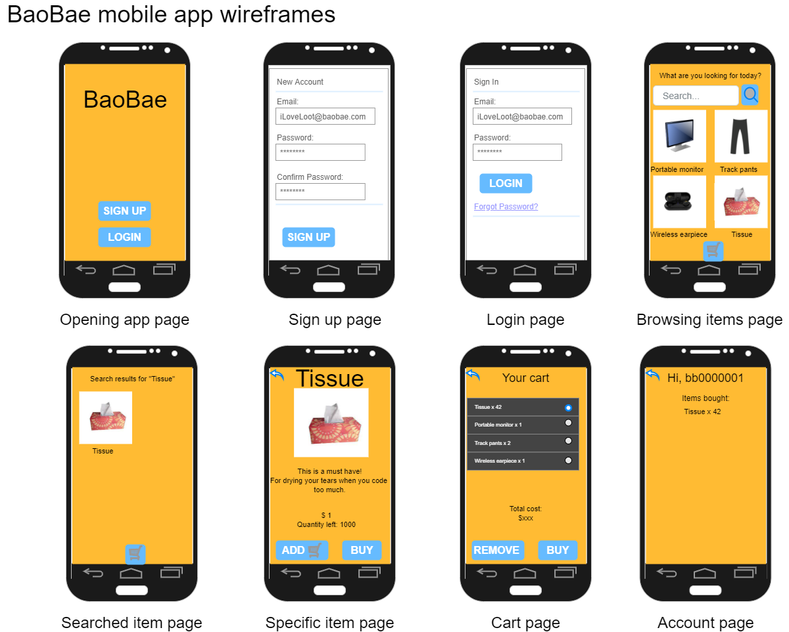
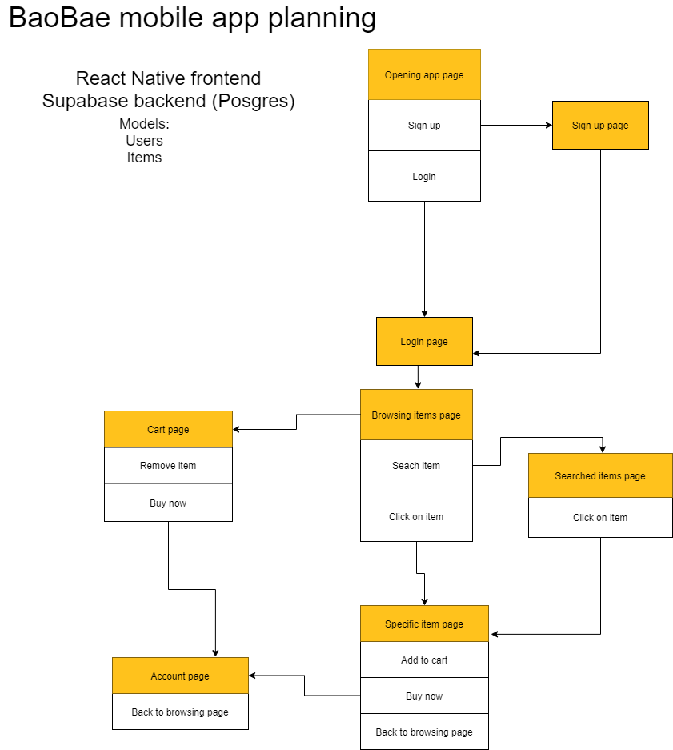
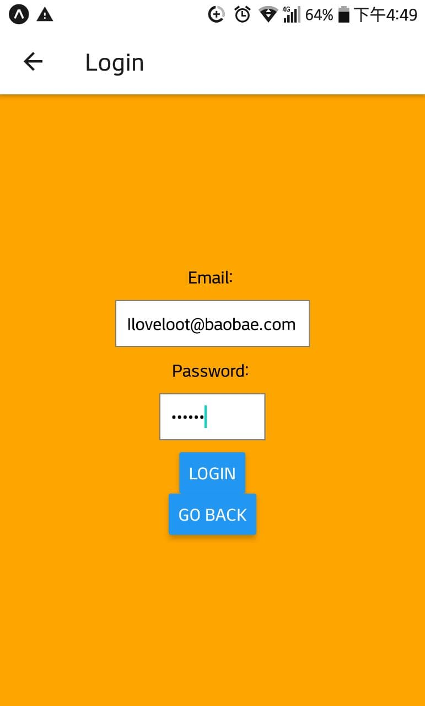
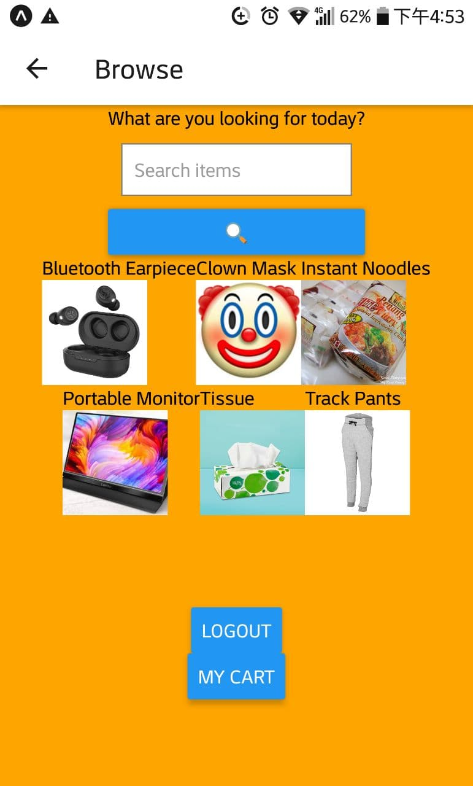
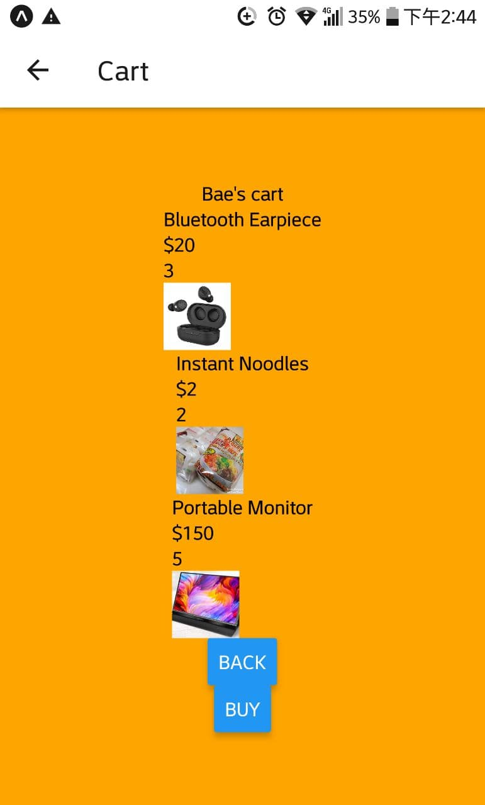

<!-- GA SEI 32 Project 4: Capstone -->
<!-- ZY, 12 Nov 2021 -->

# BaoBae

Mobile app of a TaoBao clone. Made with React Native.

## Description

A mobile app of a TaoBao clone.

Planning to keep things simple. Users can add items to cart and buy items.

### Technology Used

Technologies used to build this project.

```
- React Native
- Expo Client
- React Navigation
- Firebase

```

### Wireframes



### User Stories

```
To use the app, user should:

- Create an account with email + password
- Log in
- Search for items they want
- Add to cart if they want it
- Buy the item
- Wait for that sweet loot which will never arrive...

```

---

## Planning and Development Process



Models:
-Items: name (string), price, quantity, type (string), image (string), description (string), comments (map with arrays of comments)
-Users: email (string), username (string), cart (map with arrays of items in cart [need name/price/quantity]), bought (map with arrays of items bought [need name/price/quantity])

```
Timeline

- 12 Nov: Decided to try out React Native for final project. Did some research, watched videos to get a look of React Native.
Installed expo client and initialised first React Native project.

- 13 Nov: Started planning for app. Also went to read drawio docs for mobile app wireframe.
Created wireframes and components. Did login and signup page to test backend authentication.
Decided to ditch Supabase as backend as there are some jarring errors with React Native.
Switched to firebase, struggled quite a lot since V9 just got released and notes were still V8.
Finally got firebase authentication working.

- 14 Nov: Exploring more of firebase. Set up the database for storing the items.
Moved all relevant code from jsx to firebase backend to ensure division between frontend/backend.

- 15 Nov: Exploring firebase commands. Refined authentication code.
Added some data and test update of item in collection.
Tested out retrieval of all data from collection + specific item from collection.
Edited the browsing and item screens accordingly. Still tinkering with Firebase backend.

- 16 Nov: Trying out addition of comments + items to cart for firebase.
Created screens for adding to cart + buying items, and added the relevant firebase code.
Struggled quite a bit updating the cart items in the database, finally got it right after a long time.
CartScreen now reflects the items in the user's cart.


```

### MVP in progress...

- [x] Opening
- [x] Login
- [x] Signup
- [ ] Browse
- [ ] Search
- [x] Item
- [x] Buy
- [x] Cart
- [ ] Account

### Sample images...






---

## References

Had to do some research to better understand the topic and here are some websites I visited:

React Native Docs https://reactnative.dev/  
Video on React Native https://www.youtube.com/watch?v=0-S5a0eXPoc&ab_channel=ProgrammingwithMosh  
React navigation https://reactnavigation.org/docs/getting-started/  
Checking out React Native + Supabase https://www.youtube.com/watch?v=5e67b0PBcn4&list=PL2PY2-9rsgl0TTqJk3tCNJnBAjwHCjdYM&index=2&ab_channel=AaronSaunders  
Drawio mobile app wireframe https://drawio-app.com/use-draw-io-to-mockup-your-mobile-apps/  
Firebase docs https://firebase.google.com/docs/  
Reading more about firebase + react native https://www.freecodecamp.org/news/react-native-firebase-tutorial/
Require cycle message https://stackoverflow.com/questions/55664673/require-cycles-are-allowed-but-can-result-in-uninitialized-values-consider-ref  
Passing property as parameter in JS https://stackoverflow.com/questions/13760186/how-to-pass-an-object-property-as-a-parameter-javascript
