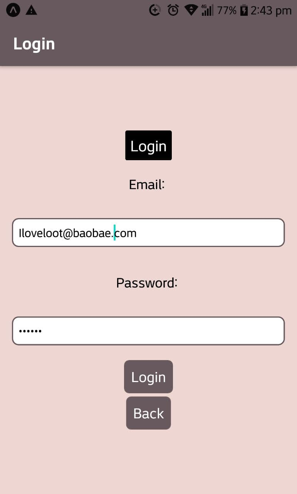
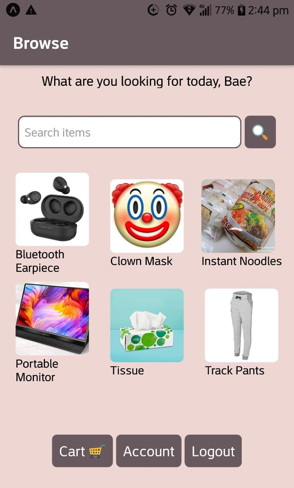
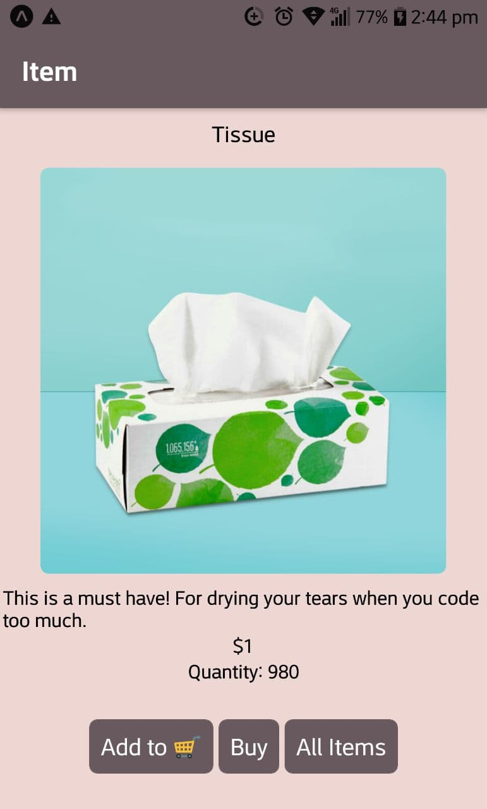
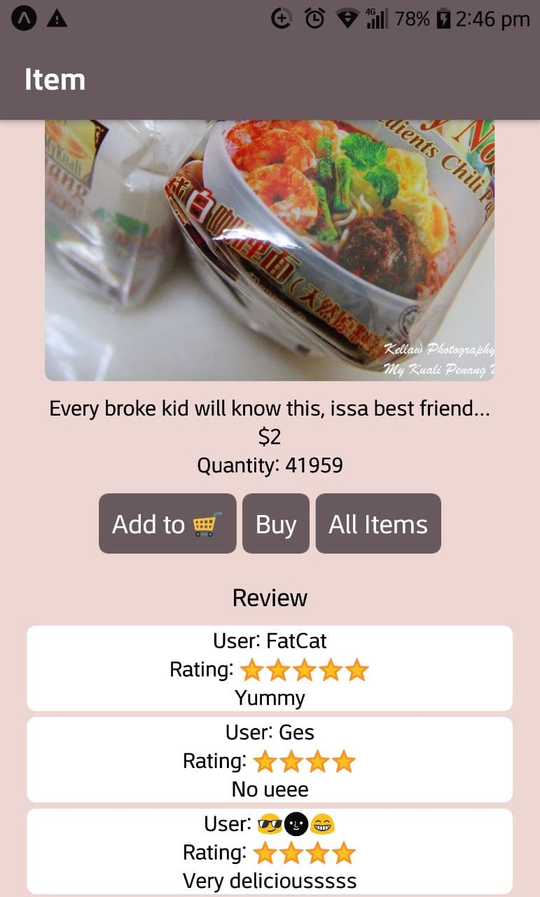
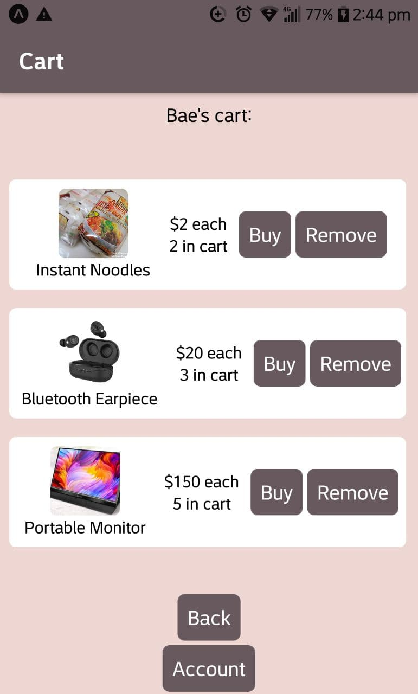
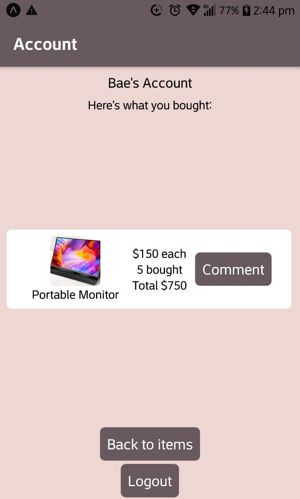

<!-- GA SEI 32 Project 4: Capstone -->
<!-- ZY, 12 Nov 2021 -->

# BaoBae


Mobile app of a TaoBao clone. Made with React Native.

## Description

A mobile app of a TaoBao clone. Just for fun.

Planning to keep things simple. Users can add items to cart and buy items.

### Accessing the Application

This app is not published on Google playstore / Apple appstore.

However, Android users can access the app. (Sorry Apple users!)

1. Download the expo app
   https://play.google.com/store/apps/details?id=host.exp.exponent&referrer=www

2. Headover to https://expo.dev/@zyteo/BaoBae  
   Scan the QR code with the expo app

3. Enjoy!

- Note app is still in development - do expect bugs.

### Video showing App features

#### Sign up
https://user-images.githubusercontent.com/86465458/143161746-d8c2e815-f82e-4f7b-bdff-31c330830c2e.mp4

#### Log in
https://user-images.githubusercontent.com/86465458/143161964-dfd5ae1c-e1c8-437e-b07d-efd5a0013c54.mp4

#### Empty cart, empty account and search feature
#### Adding to cart and buying item feature
#### Buying item from cart + comment feature
#### HOT SALE - buying until item is depleted


### Technology Used

Technologies used to build this project.

```
- React Native
- Expo Client
- React Navigation
- Firebase
- Styled components
- Adobe Photoshop

```

### Wireframes


### User Stories

```
To use the app, user should:

- Create an account with email + password
- Log in
- Search for items they want
- Add to cart if they want it
- Buy the item
- Wait for that sweet loot which will never arrive...

```

---

## Planning and Development Process


Models:

-Items: name (string), price, quantity, type (string), image (string), description (string), comments (map with arrays of comments)

-Users: email (string), username (string), cart (map with arrays of items in cart [need name/price/quantity]), bought (map with arrays of items bought [need name/price/quantity])

```
Timeline

- 12 Nov: Decided to try out React Native for final project. Did some research, watched videos to get a look of React Native.
Installed expo client and initialised first React Native project.

- 13 Nov: Started planning for app. Also went to read drawio docs for mobile app wireframe.
Created wireframes and components. Did login and signup page to test backend authentication.
Decided to ditch Supabase as backend as there are some jarring errors with React Native.
Switched to firebase, struggled quite a lot since V9 just got released and notes were still V8.
Finally got firebase authentication working.

- 14 Nov: Exploring more of firebase. Set up the database for storing the items.
Moved all relevant code from jsx to firebase backend to ensure division between frontend/backend.

- 15 Nov: Exploring firebase commands. Refined authentication code.
Added some data and test update of item in collection.
Tested out retrieval of all data from collection + specific item from collection.
Edited the browsing and item screens accordingly. Still tinkering with Firebase backend.

- 16 Nov: Trying out addition of comments + items to cart for firebase.
Created screens for adding to cart + buying items, and added the relevant firebase code.
Struggled quite a bit updating the cart items in the database, finally got it right after a long time.
CartScreen now reflects the items in the user's cart.
AccountScreen now reflects the items that the user bought.
Item quantity will decrease accordingly when user purchases the item.
Done up the search function on the browse screen.

- 17 Nov: Already had keys in my lists, but still got warning "Each child in a list should have a unique "key" prop."
Used index for the keys to remove warning message. Added code to clean text from search query.
Add comment to the item page.
Polish up code for the cart / bought items such that the items update properly.
MVP completed, will now move on to styling.

- 18 Nov: Will refine project based on 1 to 1 discussion.
Removed react fragments which was causing the "Each child in a list.." warning.
Refine search for item types
Realised styled components work on React Native. Yes!
Created logo with photoshop.
Done styling for the screens.

- 19 Nov: Refine styling.
Removed back button from header.
Removed blank space for scroll view.

- 23 Nov: Refine the logic and code for the app.
Update app such that buy button doesn't show when item quantity is 0.
Update buying logic to check if item quantity > quantity buyer wants to buy, and then perform relevant code.
Tested app on another phone and edited styling accordingly.

- 24 Nov: Screen record video of app showing features.


```

### MVP complete!

- [x] Opening
- [x] Login
- [x] Signup
- [x] Browse
- [x] Search
- [x] Item
- [x] Buy
- [x] Cart
- [x] Account
- [x] Comment

### Styling complete!

- [x] Opening
- [x] Login
- [x] Signup
- [x] Browse
- [x] Search
- [x] Item
- [x] Buy
- [x] Cart
- [x] Account
- [x] Comment

### Sample images...








---

## References

Had to do some research to better understand the topic and here are some websites I visited:

React Native Docs https://reactnative.dev/  
Video on React Native https://www.youtube.com/watch?v=0-S5a0eXPoc&ab_channel=ProgrammingwithMosh  
React navigation https://reactnavigation.org/docs/getting-started/  
Checking out React Native + Supabase https://www.youtube.com/watch?v=5e67b0PBcn4&list=PL2PY2-9rsgl0TTqJk3tCNJnBAjwHCjdYM&index=2&ab_channel=AaronSaunders  
Drawio mobile app wireframe https://drawio-app.com/use-draw-io-to-mockup-your-mobile-apps/  
Firebase docs https://firebase.google.com/docs/  
Reading more about firebase + react native https://www.freecodecamp.org/news/react-native-firebase-tutorial/
Require cycle message https://stackoverflow.com/questions/55664673/require-cycles-are-allowed-but-can-result-in-uninitialized-values-consider-ref  
Passing property as parameter in JS https://stackoverflow.com/questions/13760186/how-to-pass-an-object-property-as-a-parameter-javascript  
React Native keys https://stackoverflow.com/questions/37578548/react-native-setting-keys-on-elements  
Logo icon https://thenounproject.com/newhaircut/  
Colour palette https://www.canva.com/colors/color-palettes/rosy-flamingo/  
Remove blank space for scrollview https://bianca-dragomir.medium.com/filling-the-remaining-space-in-a-react-native-scrollview-496bc017ec4e  
Check data exist https://firebase.google.com/docs/firestore/query-data/get-data  
